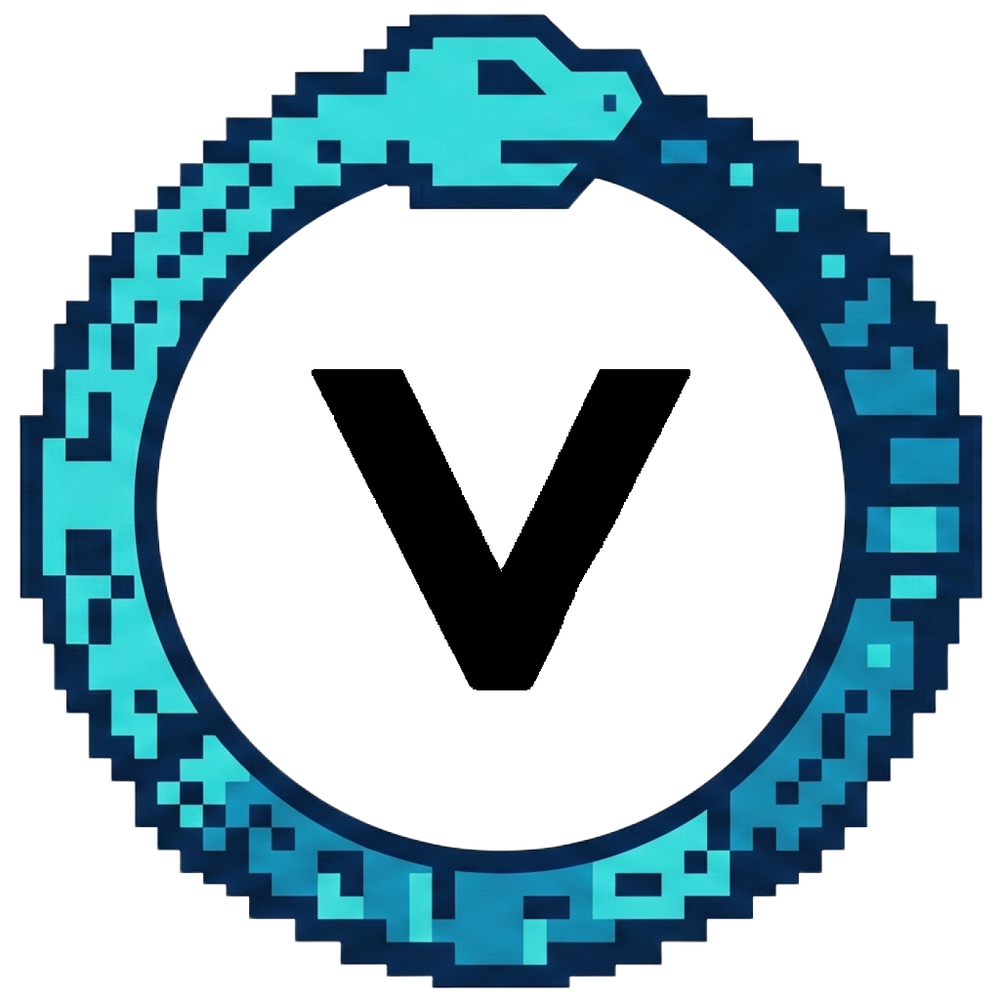

<div align="center">

<!-- LOGO -->


# VAAL

**V**-**A**I-**A**uto-**L**oop

AI 自动化任务循环工具

[](https://github.com/daoif/vaal)
[](https://nodejs.org)
[](LICENSE)
<p align="center">
  💬 <a href="https://qm.qq.com/q/AHUKoyLVKg">QQ 交流群: 993975349</a>
</p>
</div>

---

## 简介

VAAL 帮助开发者自动化完成编码任务。通过调用 AI CLI（Codex、Claude 等）循环执行任务列表，每完成一个任务就自动验证和 Git 提交。

**核心特性：**
- **零依赖** - 只需 Node.js，无需 npm install
- **槽位架构** - 10 个预制槽位脚本，开箱即用，按需替换
- **三层约束** - 项目/模块/任务级约束，自动合并传递给 AI
- **依赖检查** - 自动检测任务依赖，按正确顺序执行
- **AI 引导** - 文档驱动，让 AI 读取文档引导你完成配置
- **进度追踪** - progress.txt 记录执行历史和耗时

## 快速开始

> **你不需要看任何文档。** 只需复制下面的提示词发给AI，AI会读取文档并引导你完成一切。

### 提示词1：安装与初始化

```
git clone https://github.com/daoif/vaal.git .vaal
然后读取 .vaal/init/docs/GUIDE.md，帮我完成初始化配置。
```

### 提示词2：拆分任务

```
读取 .vaal/split/docs/GUIDE.md，帮我拆分任务。
```

### 提示词3：执行任务

```
读取 .vaal/exec/docs/GUIDE.md，帮我执行任务。
```

> 就这3句话。复制 → 粘贴给AI → AI自动引导你。

## 依赖要求

| 依赖 | 说明 |
|------|------|
| **Node.js** | 运行脚本 |
| **Git** | 自动提交 |
| **AI CLI** | 执行任务 |

**已支持的 AI CLI：**
- [Codex](https://github.com/openai/codex) (OpenAI)
- [Claude Code](https://github.com/anthropics/claude-code) (Anthropic)

> 其他 CLI 可自行扩展，欢迎提 [Issue](https://github.com/daoif/vaal/issues) 或 [PR](https://github.com/daoif/vaal/pulls)。

## 文档

| 类别 | 文档 |
|------|------|
| **入门** | [初始化引导](init/docs/GUIDE.md) |
| **配置** | [配置说明](exec/docs/CONFIG.schema.md) |
| **任务** | [拆分引导](split/docs/GUIDE.md) |
| **高级** | [设计文档](_dev/DESIGN.md) |

## 许可证

MIT
